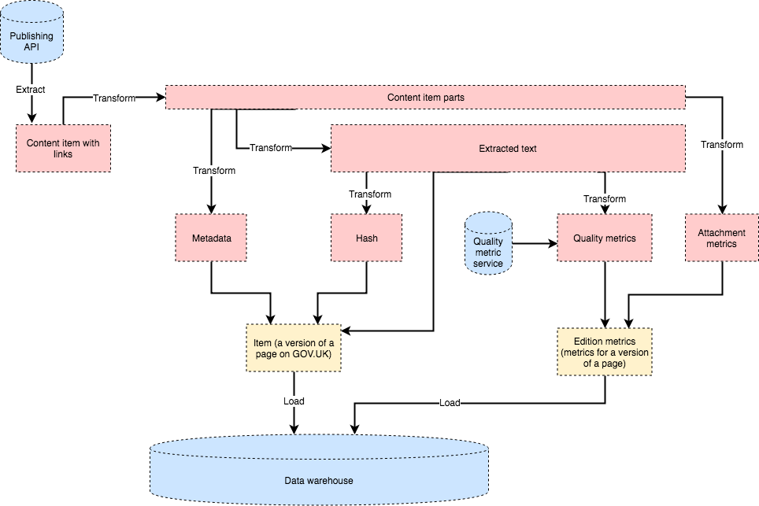

# ADR 009: Treat parts of a content item as individual items

04-06-2018

## Context

Each version of a content item is represented as a single item in the data warehouse.

However, there are some types of content item that have multiple parts. Each part has its own page on GOV.UK but all of them are edited together as a single document.

The most important ones are:
- guides ([example](https://www.gov.uk/pay-vat))
- foreign travel advice ([example](https://www.gov.uk/foreign-travel-advice/azerbaijan))

This means that the metrics we store don't cover all the pages users can interact with.

## Decision
### 1. Use URLs to identify content, not content IDs
When we process incoming content, we are going to first check if it is a multi-part format. If it is, we will split the content item into its compenent parts, and extract content from each part, rather than combine the content from all parts.

Each part will be uniquely identified by a combination of:
1. The URL (content item base path + slug)
2. The `payload_version` from the publishing API message (which distinguishes different versions of the same content item)

### 2. Use data from the publishing API message, rather than issuing an additional request to the content store
We should extract all the information we need from the publishing API message that triggers the process.

### Data flow
This diagram shows the ideal data flow for ingesting content into the data warehouse.

The outputs are `Dimension::Item` records (identified by URL and version) and a `Facts::Edition` record for each one, which stores the edition metrics.

The content item is split into parts at the beginning of the pipeline, based on the `details.parts` object in the content item JSON.

For each part, we need to work out if we're updating an item or creating a new one. Previously we made this decision for the combined item. New items are created if the publishing API message represents a `major`, `minor` or `unpublish` update. If the publishing API message is a `link` update we just update the metadata on the existing item.

Each part is then passed through the presenters to extract text from each part, which is then hashed.

If the hash is unchanged from the previous version of that content item (or the content item is a new one), we fetch quality metrics and populate the `Facts::Edition` record. Otherwise we don't create that record.

### Benefits:

- Users can analyse individual guide and travel advice pages individually
- The data warehouse doesn't depend on frontend infrastructure.

## Status

Accepted.

[1]: http://github.com/alphagov/publishing-api
